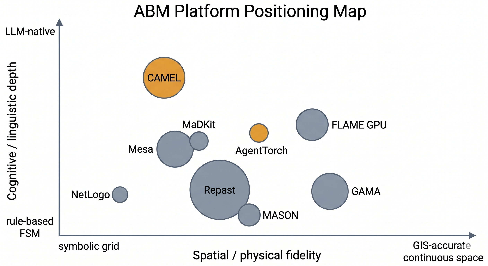
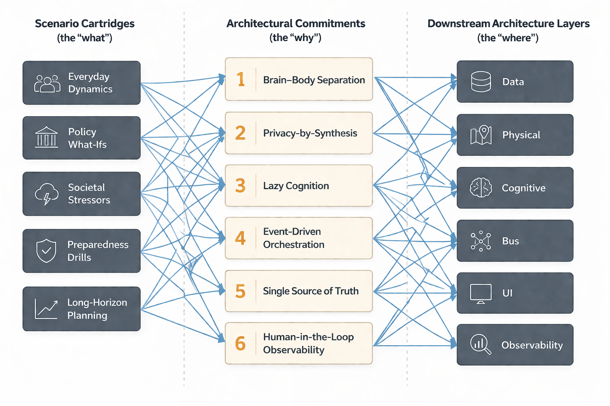
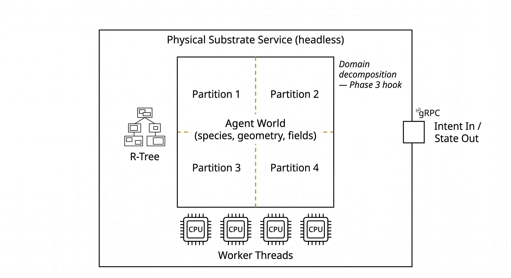
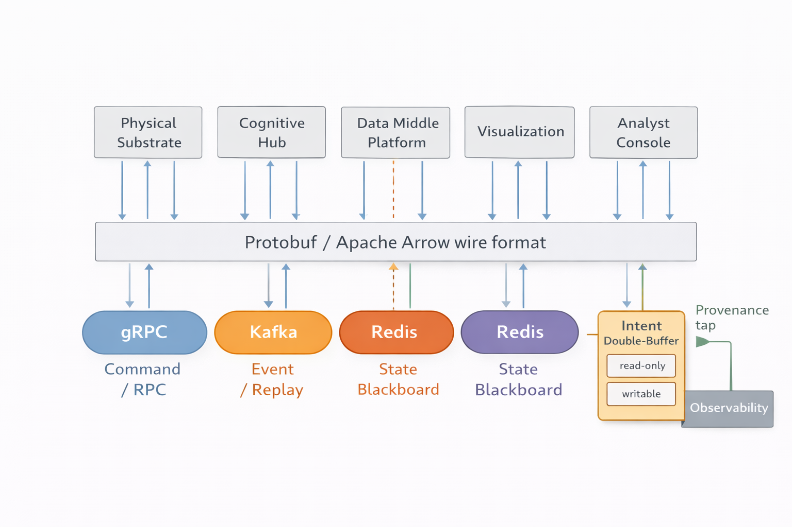
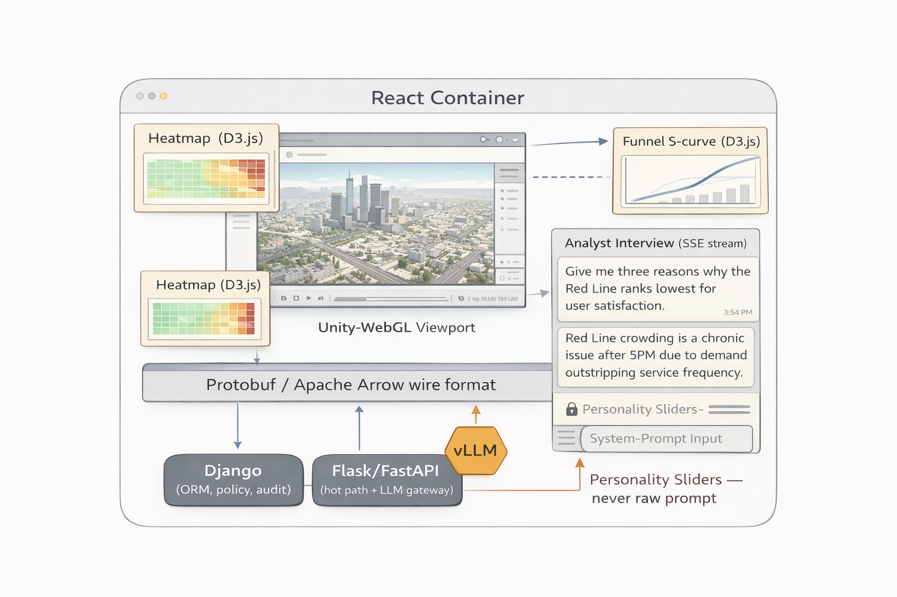
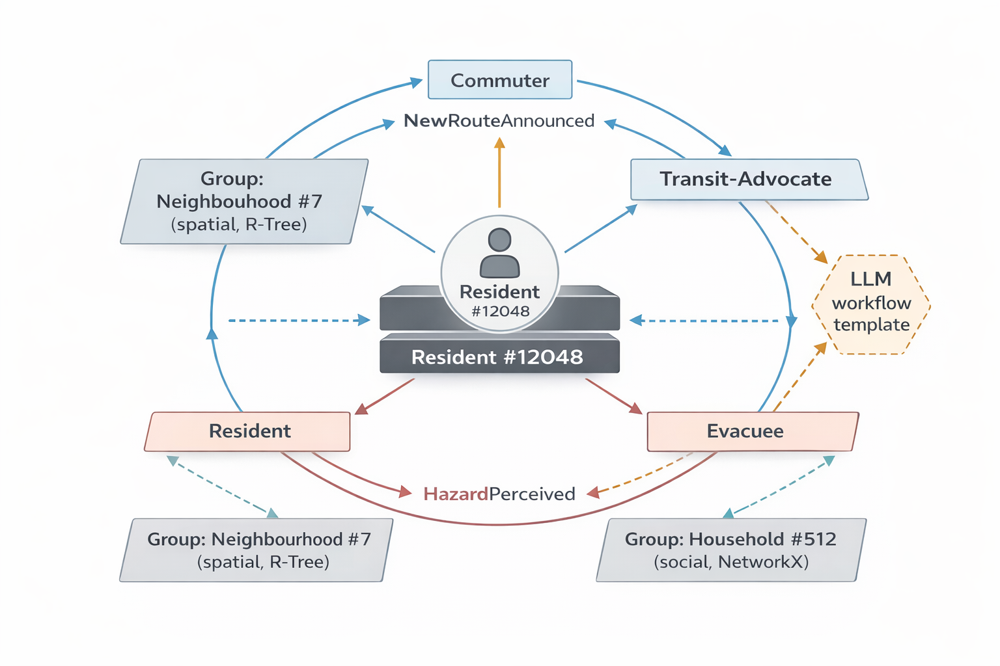
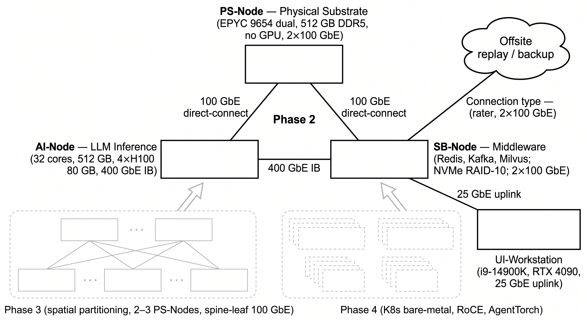
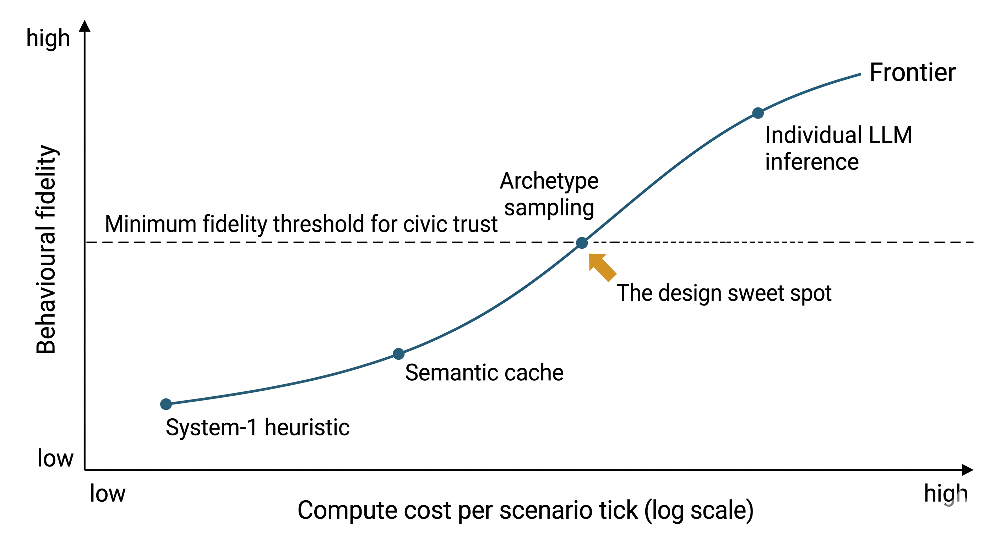

# Building a Social Digital Twin

*A Systems Engineer's Blueprint for ABM, LLMs, and Trust at City Scale*

<section class="essay-sdtwin" markdown="1">

<blockquote class="essay-epigraph">
  <p><em>Scale without validation is just expensive noise. This post is about the rest of the sentence — what it takes to build a simulation a city could actually trust.</em></p>
</blockquote>

<nav class="article-toc" aria-labelledby="article-map">
  <p class="toc-eyebrow">Reading Guide</p>
  <h2 id="article-map">Table of Contents</h2>
  <div class="toc-grid">
    <div>
      <p><strong>Main sections</strong></p>
      <ol>
        <li><a href="#from-prototype-to-platform">From Prototype to Platform</a></li>
        <li><a href="#where-the-industry-actually-is">Where the Industry Actually Is</a></li>
        <li><a href="#what-the-platform-must-do">What the Platform Must Do</a></li>
        <li><a href="#software-architecture">Software Architecture</a></li>
        <li><a href="#hardware-architecture">Hardware Architecture</a></li>
        <li><a href="#technical-challenges-and-in-depth-optimisation">Technical Challenges and In-Depth Optimisation</a></li>
        <li><a href="#directions-for-future-research">Directions for Future Research</a></li>
        <li><a href="#summary">Summary</a></li>
      </ol>
    </div>
    <div>
      <p><strong>Architecture deep dives</strong></p>
      <ul>
        <li><a href="#41-simulation-mechanics">4.1 Simulation Mechanics</a></li>
        <li><a href="#42-data-middle-platform">4.2 Data Middle Platform</a></li>
        <li><a href="#43-physical-substrate">4.3 Physical Substrate</a></li>
        <li><a href="#44-cognitive-and-socio-emotional-hub">4.4 Cognitive and Socio-Emotional Hub</a></li>
        <li><a href="#45-communication-bus-and-interaction-fabric">4.5 Communication Bus and Interaction Fabric</a></li>
        <li><a href="#46-visualisation-and-decision-support">4.6 Visualisation and Decision Support</a></li>
        <li><a href="#47-llm-integration-and-large-model-orchestration">4.7 LLM Integration and Large-Model Orchestration</a></li>
        <li><a href="#48-agr-as-the-organisational-mechanism">4.8 AGR as the Organisational Mechanism</a></li>
      </ul>
    </div>
  </div>
  <p class="toc-note"><em>Readers interested mainly in architecture can jump straight to §4; deployment begins in §5.</em></p>
</nav>

<figure class="article-figure article-figure-wide">
  <div class="figure-card">
    
  </div>
  <figcaption>Figure 1 — A Social Digital Twin is a layered civic stack, and trust is the constraint that spans it.</figcaption>
</figure>

---

<a id="from-prototype-to-platform"></a>
## 1. From Prototype to Platform

In an [earlier post](https://stevenbush.github.io/Social-Complexity-Insights/2026/03/31/simulating-society-age-of-ai/) I wrote about what I thought the next frontier of Agent-Based Modeling would look like in the age of large language models. I put forward an aspiration: give every agent enough intelligence to reason in natural language, run those agents at the scale of a real population, and keep the whole thing *auditable* — so that a simulation that can be trusted to inform public decisions is not an accident but a design goal.

In a [follow-up post](https://stevenbush.github.io/Social-Complexity-Insights/2026/04/04/building-interface-for-simulated-societies/) I took a small, honest step in that direction — a prototype interface for conversing with a simulated society. It was useful as a first probe of what LLM-native interaction with a running ABM might feel like, and I was careful, then and now, not to oversell it. That project was a prototype, not a platform. It did not address — and was never meant to address — the harder engineering questions a production-grade ABM system must face: how the physical substrate stays deterministic under asynchronous cognition; how privacy is enforced at the data layer; how LLM costs stay sane at five- or six-digit agent counts; how any of it is made trustworthy enough for civic use. A production project lives or dies on those questions. They are what I want to take up in this post.

I still believe the aspiration. But a frontier is also a place you walk to, not a place you declare. So let me come back down to earth.

Imagine a municipal team that, sometime in the next months, will be asked to stand up a Social Digital Twin for its city. Not a demo, not a paper. A working platform that a planner can open on a Monday morning and ask questions of. At the end, that platform may need to answer all of these, on the same substrate:

- *What does mobility look like on a wet November Tuesday, and how does that shift when the ring road is closed for maintenance?*
- *If we pedestrianise the old market quarter, who loses access to what, and by how much?*
- *If a chemical incident at the edge of the inner city forces a rapid evacuation, where are the choke points and how long until the last resident is clear?*
- *If misinformation about a vaccination campaign starts trending among a particular subpopulation, where does it land three days later?*
- *Given a plausible demographic drift over the next decade, which neighbourhoods are most exposed to infrastructure stress?*

No single question lives on a single scale. No single question uses a single framework's favourite trick. **And no single question is safe to answer with a black box.**

Throughout this post I will talk about a composite, anonymised reference setting — I will call it **Civitas-Twin**, serving a mid-sized reference municipality of roughly 200,000 residents. It is not a specific city. It is deliberately a family of cities, a bundle of typical requirements a municipal team runs into when it tries to build something like this. The platform must host what I will call *scenario cartridges* — one cartridge per question family — plugged into the same underlying twin. I want the blueprint I describe here to transfer: a reader who is standing up a comparable project should be able to read this post as an engineering document, not a travelogue.

<figure class="article-figure article-figure-wide">
  <div class="figure-card">
    
  </div>
  <figcaption>Figure 2 — One synthetic population and one physical substrate can support many scenario cartridges.</figcaption>
</figure>

The thesis of this post, then, is not *which framework to pick*. It is something older and less glamorous. **The real craft in a Social Digital Twin is decomposition.** Which concerns belong together, which belong apart, which tools own which layer, which contracts cross which wire. Get that right and the framework question answers itself. Get it wrong and no framework saves you.

I will also carry forward one discipline from my previous post: *trustworthiness is not a feature in a layer, it is a property of the whole stack.* Privacy-by-synthesis in the data layer, provenance in the bus, interpretability in the cognitive hub, observability in the visualisation, human-in-the-loop everywhere. That thread runs through every section below, including the ones that read like pure engineering. 

---

<a id="where-the-industry-actually-is"></a>
## 2. Where the Industry Actually Is

Before the blueprint, a diagnosis.

There is a persistent fantasy in ABM discourse that one day a single framework will arrive that is at once spatially faithful, computationally massive, cognitively rich, linguistically fluent, reproducibly rigorous, and operationally deployable. That framework does not exist. It will not exist. Those six virtues are not just unachieved — they are in *tension* with one another, in ways that structural choices at the bottom of a framework lock in from its earliest days.

**No single platform satisfies the Civitas-Twin portfolio on its own.** The sensible move is therefore not to pick the platform that loses by the least, but to assemble a stack where each layer is inhabited by the tool that loses by the least *for that layer*.

Below is an honest comparative view of the platforms a serious team will consider.

| Platform | Core positioning | Scale ceiling (practical) | Scheduling model | Spatial fidelity | LLM integration pathway | Calibration / reproducibility maturity | Organizational semantics (AGR-style) |
|---|---|---|---|---|---|---|---|
| **NetLogo** | Teaching + mechanism prototype | ~10⁴ agents | Global synchronous tick | Grid-first, GIS as extension | External tool via RPC (painful) | High — reproducible by construction | Weak (patches only) |
| **Mesa** (+ `mesa-geo`, `mesa-frames`, `mesa-llm`) | Python research hub | ~10⁵ agents with care | Flexible activation, single-process | Good via `mesa-geo` | Native Python; embeddable module | Moderate — discipline required | Weak but extensible |
| **Repast Simphony / HPC / 4Py** | Engineering-grade ABM family | 10⁶–10⁷ on cluster | Discrete event or time-step | Strong (Geography, Grid, Network) | External microservice; bus-mediated | High — statecharts, batch runner | Moderate (contexts, projections) |
| **GAMA** | GIS-first spatial simulation | ~10⁵ agents with headless mode | Flexible, agent-local | Excellent — GAML geometry ops | External via gRPC/Kafka bridge | Good — headless, reproducible | Moderate (species, macrospecies) |
| **MASON / MASON Distributed** | Java research-grade engine | 10⁵–10⁶ distributed | Discrete event | Good | External microservice | Good | Moderate |
| **AgentTorch** | Differentiable, GPU-native ABM | 10⁶+ on GPU cluster | Tensor-parallel batched | Limited to tensorisable fields | Native-core via archetype sampling | Emerging — calibration via gradient | Weak (not its point) |
| **FLAME GPU** | Massive-scale rule execution on GPU | 10⁷ for simple agents | Tick-parallel on GPU | Continuous with care | External only | Emerging | Weak |
| **CAMEL / AgentScope** (complementary) | LLM-native multi-agent society | 10³–10⁴ agents today | Asynchronous dialogue-driven | Effectively none | Native core | Weak today | Strong linguistically |
| **MaDKit** (complementary) | Organization-theoretic MAS (AGR) | 10³–10⁴ | Async actor messages | None | External | Moderate | Excellent — AGR is native |

Three honest observations follow from the table.

**First**, every mature spatial/physical platform is either JVM-based (Repast, GAMA, MASON) or GPU-native (AgentTorch, FLAME GPU). The Python ecosystem (Mesa) wins the research-hub role because of its data and AI neighbours, not because it wins on raw throughput. This is a durable fact, and any blueprint that pretends otherwise eventually runs into the Global Interpreter Lock the hard way.

**Second**, every mature LLM-native framework (CAMEL, AgentScope) has been built without a real physical substrate. Its native representation of the world is a message list, not a street network. Any attempt to bolt on precise physics later is a rewrite, not a refactor.

**Third**, the frameworks that understand *organisations* the best (MaDKit, and to a lesser extent Repast via contexts and projections) are the least represented in the LLM-integration literature. This is a surprising gap, because the LLM's system prompt is, in effect, the *role* in an Agent–Group–Role scheme. The match is natural when you look at it squarely.

<figure class="article-figure article-figure-wide">
  <div class="figure-card">
    
  </div>
  <figcaption>Figure 3 — ABM platforms sit on a trade-off map between physical fidelity and cognitive depth.</figcaption>
</figure>

A consequence for engineering teams is worth naming clearly. **The right architectural move for a Social Digital Twin is not to *choose* a platform but to *route through* several**, with each platform running headless in the layer it owns, and with a communication bus carrying the contracts between them.

A second consequence is that the much-debated question of "how do we integrate the LLM" has more than one answer, depending on the layer. The same system can use an LLM as an *external tool* in the data layer (document extraction, schema mapping), as an *embeddable cognitive module* in the Cognitive Hub (agent deliberation), and as a *native-core* orchestrator for analyst-facing natural-language querying at the UI. Any design that conflates the three ends up either over-spending on tokens or under-delivering on fidelity.

With that landscape in hand, the rest of this post is structured as a blueprint: requirements first, software architecture second, hardware third, optimisation fourth, open research fifth. Each section treats trustworthiness as a load-bearing constraint, not a concluding flourish.

---

<a id="what-the-platform-must-do"></a>
## 3. What the Platform Must Do — Requirements, Constraints, Commitments

The platform is not a single application. It is a **portfolio of scenario cartridges** riding on a shared substrate. Each cartridge pulls on a different subset of the system's capabilities. Specifying the platform therefore means specifying the *envelope* of all cartridges, not any one of them.

The envelope is captured by two matrices.

**Cartridge × capability matrix.**

| Cartridge | Typical population slice | Spatial fidelity needed | Cognitive depth needed | Latency budget (inside a single scenario run) | Horizon |
|---|---|---|---|---|---|
| Everyday dynamics | Full population (≤200k) | Medium — road network, modal choice | Low — mostly statistical behaviour | Near-real-time for dashboards | 24 h–1 yr |
| Policy what-ifs | Affected subpopulation (10k–100k) | High — streets, parcels | Medium — deliberation under new rule | Minutes | Months |
| Societal stressors | Networked subpopulation (1k–50k) | Low–medium | High — belief, affect, social contagion | Hours | Days–weeks |
| Preparedness drills | Localised cohort (10k–60k) | High — buildings, egress routes | Medium–high — fear, crowd response | Seconds, near real time | Minutes–hours |
| Long-horizon planning | Full population with drift | Medium | Low — aggregate projection | Offline batch | Years–decades |

**Functional / non-functional / constraint matrix.**

| Dimension | Requirement |
|---|---|
| Functional | Instantiate a synthetic population; run a cartridge; expose run-time state; support analyst interviews of agents; export replayable traces. |
| Performance | Tick budget ≥ 10 Hz for preparedness cartridges; ≥ 1 Hz otherwise. 50k active agents as the design target; 200k reachable without rearchitecture. |
| Determinism | Physics layer must be bit-exact reproducible given a seed; cognitive layer reproducible modulo LLM non-determinism (seeded generators, deterministic batching, cached outputs). |
| Safety | No direct editing of LLM system prompts from the UI; every intent written to the physics layer must carry a provenance tag. |
| Privacy | No individual-level identifiers in the data layer; synthetic populations only; all spatial placement is inside building-footprint polygons, never on real residents. |
| Auditability | Every scenario run produces a structured trace sufficient to replay it, including LLM prompt-response pairs under cache. |
| Operations | Runs on a minimal cluster (≤ 4 nodes) for Phase 2; horizontal scale-out reachable without rewrite. |
| Constraints | Modest municipal compute budget; small interdisciplinary team (≤ 8 people); mixed Python / JVM / JS skills on staff. |

From these two matrices I commit to six architectural principles. I call them *commitments* because everything downstream derives from them, and because the word carries the weight a design document should carry.

1. **Brain–Body Separation.** The physical simulation and the cognitive reasoning run in different processes, in different languages, under different clocks, connected by a typed bus.
2. **Privacy-by-Synthesis.** The authoritative population is synthetic by construction. Real microdata never leaves its original custodian.
3. **Lazy Cognition.** An LLM call is a resource to allocate, not a default. Most of the time most agents are dormant; they earn a call.
4. **Event-Driven Orchestration.** Scheduling is driven by typed events on a durable bus, not by a global synchronous tick, because the cartridges that matter do not share a natural clock.
5. **Single Source of Truth.** The physics layer owns authoritative spatial state. The UI never computes; it renders. The cognitive layer reads, then writes intents, never state.
6. **Human-in-the-Loop Observability.** Every scenario must be *interrogable* — an analyst must be able to pick any agent, read why it did what it did, and follow the provenance back to the inputs.

<figure class="article-figure article-figure-wide">
  <div class="figure-card">
    
  </div>
  <figcaption>Figure 4 — Every downstream design decision must trace back to one of six architectural commitments.</figcaption>
</figure>

The rest of this post is, in effect, a long justification of those six commitments — and a demonstration of the design they imply.

---

<a id="software-architecture"></a>
## 4. Software Architecture — A Layer-by-Layer Blueprint

The software architecture of Civitas-Twin is a six-layer stack, crossed by a single vertical spine.

The six layers, bottom to top:

1. **Data Middle Platform** — authoritative spatial store, synthetic population, vector memory, state blackboard, social graph, analytics warehouse.
2. **Physical Substrate** — the deterministic, spatially-explicit body of the simulation.
3. **Cognitive & Socio-Emotional Hub** — the brain, asynchronous and event-driven, where LLMs live.
4. **Communication Bus & Interaction Fabric** — the wire format and channels that bind the other layers.
5. **Visualisation & Decision Support** — the human-facing surface.
6. **Human-in-the-Loop** — the analyst, the planner, the auditor, with tools to interrogate runs.

The vertical spine crossing all six: **Observability & Provenance.** Every event, every intent, every LLM prompt-response pair, every data derivation passes a provenance tap and is made available for interrogation.

<figure class="article-figure article-figure-wide">
  <div class="figure-card">
    
  </div>
  <figcaption>Figure 5 — Six horizontal layers, one vertical observability spine.</figcaption>
</figure>

Borrowing a framing that deserves wider circulation: the physical substrate is a deterministic *L1* with microsecond dynamics; the cognitive hub is a *L2* operating on seconds-to-minutes; and, where needed, a *L3* macro-optimisation layer runs slower still over the aggregate population. L1 / L2 / L3 do not share a clock and do not need to. What they share is a bus, a contract, and an agreement that intents flow up and states flow down.

<a id="41-simulation-mechanics"></a>
### 4.1 Simulation Mechanics and the Temporal Decoupling Insight

The simulation runs forward in tick-shaped steps, but the ticks are *not* globally synchronous across layers. The physical substrate advances at its own clock — 10 Hz for high-fidelity cartridges, 1 Hz for everyday dynamics, slower for long-horizon planning. The cognitive hub does not wait for it. Cognitive computation is triggered by events; most agents most of the time are dormant; when an agent is roused, it runs its own cognitive micro-loop asynchronously, potentially across several physics ticks, before publishing an intent that the physics layer picks up at the next opportunity.

**This temporal decoupling is the single most important design idea in the whole architecture.** It allows an LLM's cognitive call — which takes hundreds of milliseconds to seconds — to coexist with a physics tick that must complete in tens of milliseconds. It also resolves a problem that otherwise has no solution: if the physics layer waited for the cognitive layer, the system would stall at the slowest call. If the cognitive layer cannot catch up, the agent falls back onto a fast, rule-based *System 1* response while its slower *System 2* deliberation continues in the background.

Put another way: every agent is a distributed system with a fast reflex and a slow reasoner, and the system around them is engineered to tolerate that disagreement.

<a id="42-data-middle-platform"></a>
### 4.2 Data Middle Platform — Privacy-First Synthesis and Foundational Stores

The data layer is the foundation everything else stands on. It has two responsibilities. First, to **synthesise** a population that is statistically faithful and legally safe. Second, to **host and serve** state for the live simulation.

**Synthesis pipeline.** The authoritative population is generated offline in four stages. A WGAN — chosen over vanilla GAN for the Wasserstein distance, which preserves gradient signal even when distributions do not overlap and helps with mode collapse — learns the joint distribution over individual-level attributes from public-statistics-class microdata. Individuals are aggregated into households by demographic keys. The result is calibrated to municipal macrodata via Iterative Proportional Fitting so that marginal distributions (age by district, employment by age, tenancy by household type) match observed statistics. Finally, each household is allocated a spatial anchor inside a residential building footprint, randomly within the polygon so that no synthetic individual is traceable to a real address.

Two points matter. **No real individual identity ever crosses a trust boundary** — this is not a feature, it is a precondition for operation under any serious data-protection regime. And every row carries a lineage hash so that any downstream result can be traced to the data generation it came from.

<figure class="article-figure article-figure-wide">
  <div class="figure-card">
    
  </div>
  <figcaption>Figure 6 — From microdata to agents: a four-stage, privacy-first pipeline.</figcaption>
</figure>

**Live stores.** The data middle platform is plural, not monolithic. Each store is chosen for the access pattern it serves.

| Store | Role | Why this choice |
|---|---|---|
| PostGIS | Authoritative spatial database — buildings, roads, parcels, synthetic population anchors. | Mature, indexed, OGC-compliant; pairs with Geoserver. |
| Geoserver | Streaming spatial delivery via WFS / WMTS. | Lazy-loading avoids monolithic GIS loads at startup; the physics layer pulls tiles on demand. |
| Redis | State blackboard — per-agent status, intent, pressure. | Sub-millisecond overwrite for hot-path state reads from the cognitive hub. |
| Milvus | Vector memory store for agent memory streams and semantic-cache keys. | Scales to tens of millions of embeddings with tunable ANN indices. |
| Neo4j | Social graph — household, workplace, friendship, weak ties. | Cypher queries over multi-hop relationships for contagion and reflection. |
| DuckDB / Parquet | Analytics warehouse for replay and post-hoc analysis. | In-process, columnar, zero-configuration for interactive analyst queries. |

Nothing in this list is novel on its own. The discipline is to use each for exactly what it is good for, and to *not* reach across boundaries — the physics layer does not query Neo4j; the UI does not mutate Milvus; the cognitive hub does not write to PostGIS.

<a id="43-physical-substrate"></a>
### 4.3 Physical Substrate — The Spatially-Explicit Body

The physical substrate is where geometry is honest: where an agent really has a position, where a road really has a length, where an R-Tree really returns the three nearest neighbours. This is a layer I want to run on a JVM, in headless mode, under true multithreading. My two preferred candidates are GAMA Headless and Repast (Simphony or HPC, depending on the phase). MATSim is a sibling to consider when the cartridge is mobility-heavy.

The substrate owns three things:

- The **agent world**: the species definitions, the geometry fields, the continuous/discrete dynamics, the per-tick update loop.
- The **spatial index**: an R-Tree (or variant) maintained on every tick for O(log N) neighbour queries. At 50k agents with GIS-precise polylines, the difference between a naïve O(N²) scan and a proper index is the difference between a simulation and a heatwave.
- The **headless server**: a gRPC endpoint exposing state snapshots and accepting intents. The physics engine is **never driven from the UI**; it is driven by the cognitive hub through the bus.

<figure class="article-figure article-figure-wide">
  <div class="figure-card">
    
  </div>
  <figcaption>Figure 7 — The physical substrate owns geometry, indexing, and headless execution.</figcaption>
</figure>

Three anti-patterns worth naming, because they consume months when they appear:

1. **Python-GIL-bound path-finding at population scale.** A* on a road network is branch-heavy, cache-unfriendly, and cannot be vectorised out of the GIL. At one thousand concurrent evacuees it is already slow; at ten thousand it is dead. The path-finding belongs in the JVM, not in Python.
2. **GPU for graph traversal.** A GPU is a SIMD dream and a graph-traversal nightmare. Put tensor ops on the GPU, put graph ops on cores.
3. **Letting the renderer compute anything that matters.** The Unity viewport is a spectator. The moment a developer lets it compute a distance or a collision, the single source of truth has cracked.

A fourth, less frequent but equally punishing, is to run Milvus or Kafka on mechanical disk. You have fifteen good minutes before I/O hangs. I will come back to hardware in §5.

<a id="44-cognitive-and-socio-emotional-hub"></a>
### 4.4 Cognitive & Socio-Emotional Hub — The Brain

The cognitive hub is a Python service — `asyncio`, `FastAPI`, pluggable LLM adapters. It is the noisiest layer in the system and the one most tempted to over-reach. The discipline is to keep each agent dormant by default and to let the architecture rouse it only when there is a reason.

**Lazy cognition, made concrete.** An agent's cognitive micro-loop begins when a typed event targeting it arrives on the bus — a perceptual threshold crossing (smoke detected nearby), a direct instruction (an analyst asked a question), a social event (a trusted neighbour evacuated), or a scheduled reflection (end of day). The micro-loop runs perceive → fast-reflex → deliberate → emit intent. The fast reflex is a rule-based policy that can produce a good-enough response in a millisecond. The deliberation is a workflow over the LLM that may take a second or more. Whichever finishes first publishes first; if the deliberation finishes after the reflex, it can *override* the reflex's intent. This is the System 1 / System 2 split made operational.

<figure class="article-figure article-figure-wide">
  <div class="figure-card">
    
  </div>
  <figcaption>Figure 8 — Cognition wakes on events; an LLM call is earned, not ambient.</figcaption>
</figure>

**LlamaIndex Workflows as the spine.** The deliberation layer is built on LlamaIndex Workflows, which model an agent's cognitive process as a directed graph of typed events and steps. Compared to alternatives (LangGraph in particular), Workflows' event-driven model fits better with the "many agents, sparse events, aggressive concurrency" pattern that dominates this architecture. A LangGraph-style state-machine DAG is fine when a single agent has a long hand-crafted cognitive protocol; it is awkward when fifty thousand agents are each running their own micro-workflow with cache hits and misses scattered across time.

I will show the Workflow explicitly in §4.7. For now, three design rules follow from the choice:

- **Event types are a public API.** Every event that can wake an agent is a typed contract. Adding a new event type is the unit of capability extension.
- **Steps are idempotent and cache-aware.** A retrieval step should return the same neighbours for the same query; a reflection step should consult the semantic cache before the LLM.
- **Intents are the only writes.** A cognitive step never mutates physics state directly. It emits an intent, which the physics layer picks up.

**Social computing in the hub.** The hub owns the social graph (a NetworkX view materialised from Neo4j for in-memory traversal speed) and the socio-emotional state (per-agent affect vectors — fear, anger, confusion, trust — decayed and contagion-propagated on every reflection tick). Meta-agents represent municipal actors: a media agent, a utility-operator agent, a coordination-desk agent. A meta-agent speaks to thousands of individual agents through its group membership, which is how a loudspeaker announcement or a shelter-opening notice turns into a population-level state change without a million pairwise messages.

**Archetype sampling at scale.** When the cartridge needs 200,000 agents actively deliberating, the economics of calling an LLM per agent per tick collapse. The hub responds with archetype sampling: agents are clustered into behavioural archetypes; LLM deliberation runs at the archetype level; the resulting strategy is projected back onto individuals through a mean-field-style transform. The trade-off is honest — the long tail is lost — and I will return to it in §4.7.

<a id="45-communication-bus-and-interaction-fabric"></a>
### 4.5 Communication Bus & Interaction Fabric

The bus is the least glamorous layer and the one you have to get most right. A good bus is invisible; a bad bus becomes the system.

**Three interaction patterns, one wire format.** Civitas-Twin uses three interaction patterns on the bus, each served by the right channel:

| Pattern | Channel | Examples |
|---|---|---|
| Command / RPC | **gRPC** | Physics → cognitive: *"state snapshot ready"*. Cognitive → physics: *"agent 12048 emits intent: navigate to exit node E-14"*. |
| Event / Broadcast | **Kafka** | Perception events, scheduled reflection events, meta-agent announcements. Durable; replayable. |
| State Blackboard | **Redis** | Per-agent pressure, current role, current intent pointer. Sub-millisecond overwrite; last-write-wins. |

The wire format across gRPC and Kafka is **Protocol Buffers** — not because it is fashionable but because the bandwidth maths force it. At 50,000 agents ticking at 10 Hz with a typical JSON payload per agent, the bus would carry on the order of 30 MB/s just for state updates; with Protobuf and a differential encoding it drops an order of magnitude.

<figure class="article-figure article-figure-wide">
  <div class="figure-card">
    
  </div>
  <figcaption>Figure 9 — Commands, events, and hot state travel differently, but under one contract discipline.</figcaption>
</figure>

**Clock discipline.** All services run under NTP with PTP available for sub-millisecond precision on the physics node. Skew above 100 ms produces visible artefacts — an agent "teleports" because its intent was deliberated against a physics state that has since moved on. The rule of thumb: if your clock skew budget is loose, your causality budget is already spent.

**No JSON on the hot path.** I put this in writing because every project I have seen that ignored it regretted it. Use JSON for infrequent human-readable payloads — an analyst interview, a configuration file. Never for state snapshots.

<a id="46-visualisation-and-decision-support"></a>
### 4.6 Visualisation & Decision Support

The UI is, in short, a **container with satellites**. A thin React shell holds the page; the satellites are a Unity WebGL viewport for the 3D spatial rendering, a handful of D3.js windows for analytic charts, and an interview pane that streams the LLM's natural-language response token by token over Server-Sent Events.

<figure class="article-figure article-figure-wide">
  <div class="figure-card">
    
  </div>
  <figcaption>Figure 10 — A thin container coordinates heavy visual tenants without exposing the raw prompt.</figcaption>
</figure>

**Dual-track backend.** Two backends sit behind the UI. Django handles the slow track — authentication, run metadata, audit trail, configuration versioning — everything ORM-shaped and transactional. A separate Flask or FastAPI service handles the hot track — the streaming state feed into the Unity viewport, and the LLM gateway that forwards analyst queries. The two tracks share a database but not a request loop.

**Two primary user journeys.**

- **Planner / coordinator view.** Macroscopic. A heatmap of the affected area, an S-curve showing the evacuation funnel as it fills, what-if sliders for policies like "open alternate exit", "delay rail closure by ten minutes". The planner never sees individual agents unless they ask.
- **Analyst / sociologist view.** Microscopic. Raycast on the 3D viewport picks a single agent. The UI opens an interview pane. The analyst asks *why did you not evacuate?* The Flask service composes a prompt from the agent's profile, its recent memory stream, and its current intent; routes the prompt through the LLM gateway; streams the response over SSE; and — critically — every sentence in the response is linked back to the provenance entries that produced it, so the analyst can click a sentence and see the underlying memory, data row, or perception event. An agent interview that cannot be grounded in provenance is **a story, not evidence**.

**Personality Sliders, not raw prompts.** A UI that lets users edit system prompts is a UI that breaks a scientific study. We therefore never expose raw prompts. Instead we expose a small set of *Personality Sliders* — for example, risk-aversion, herd-following propensity, trust-in-authority — that the hub maps onto system-prompt parameters according to a versioned template. The sliders are a safe, auditable abstraction: changing them is logged, their effect on prompts is documented, and the raw prompt is protected by design.

**Rendering discipline.** Fifty thousand agents at ten frames per second is not a rendering problem solved by brute force. The Unity side uses `Graphics.DrawMeshInstanced` with a single shared mesh and material, a transform matrix buffer on the GPU, and a differential sync that only pushes agents whose position has changed by more than a small epsilon or whose state class has flipped. Deserialisation happens off the main thread in a Web Worker. This is boring engineering. It is also the difference between a frame rate and a slideshow.

<a id="47-llm-integration-and-large-model-orchestration"></a>
### 4.7 LLM Integration and Large-Model Orchestration — A Deep Dive

This is the section I promised to go long on. The design of LLM integration is where most Social Digital Twins either find their depth or accumulate their technical debt. I want to lay it out in parts.

**Activation mechanism.** **An agent's LLM is dormant until a trigger fires.** We recognise five trigger classes: perceptual thresholds (a hazard, a broadcast, a close neighbour's behaviour change), direct instructions (an analyst query, a meta-agent announcement), social events (a role change of a close contact), scheduled reflections (end-of-day, end-of-scenario), and cartridge-specific custom triggers. Each trigger is a typed event on the bus. Before the LLM is touched, the hub runs a cascading check: is there a valid cached response for this trigger on this agent under this scenario? If yes, reuse it. If no, proceed to deliberation.

**Memory system and the memory-stream network.** Every agent has a *memory stream*: a time-ordered sequence of events experienced, retrieved, or reflected upon. Each entry is an embedding plus a structured record (what, when, where, with whom, importance). The stream is written on perception and on reflection; it is read via a retriever that returns the top-k entries by a combined score of recency, relevance to the current event, and importance. This is the Park-et-al Generative Agents idiom, widely known and solid — and at the Civitas-Twin scale, it is also the part of the stack a RAG discipline lives or dies on. The rest of this subsection is how I would actually build it.

***The retriever is the prompt builder.*** An LLM's context window is bounded; an agent after a week of simulated time already carries thousands of perceptions, dozens of reflections, and its share of group events. We cannot stuff that into a prompt, and we do not want to — most of it is irrelevant to the decision at hand. This is classical RAG with one twist: the corpus is the agent's own life, partitioned across the social graph, and relevance is not just semantic similarity but also *when it happened* and *how much it mattered*.

*Collection layout in Milvus.* One scenario run produces three families of collections, sized to the scenario and dropped at its end.

```text
mem_agent_<scenario_id>     # per-agent streams, partitioned by agent_id
mem_group_<scenario_id>     # shared streams: households, workplaces, neighbourhoods
mem_cache_<scenario_id>     # semantic cache of LLM reflections (separate TTL)

row schema
  id, owner_id, t_ms, event_type
  content       text                  # the structured record, rendered
  embedding     float32[1024]         # bge-m3 or equivalent multilingual encoder
  importance    float32 in [0, 10]    # set at write time by a small classifier
  perm_tier     uint8                 # who may retrieve this entry
  lineage       bytes[32]             # hash pointer to the source event / reflection
```

The embedding model is a single *pinned*, locally-served encoder — a small multilingual BERT-family model is enough — whose version is written into the scenario manifest. Replay uses the same version and the same ANN seed, so a scenario can be re-executed and return the same top-k. Embeddings of synthetic memory never leave the cluster; combined with the synthetic-population guarantee from §4.2, the data layer stays inside its privacy envelope.

*Retrieval score and access control.* Each candidate is scored as `α·cosine(q, e_i) + β·recency(t_now, t_i) + γ·importance(e_i)`, with recency as an exponential decay whose half-life τ is a cartridge parameter — hours for preparedness, days for policy, weeks for long-horizon planning. The `(α, β, γ, τ)` tuple is tuned during calibration and frozen into the manifest; retrieval is, in this sense, a *calibrated subsystem*, not a default. **Access control lives in the retriever, not in the prompt.** Every query carries `(agent_id, social-graph snapshot)`; the retriever resolves the partitions the agent may legally read — its own stream, the groups it belongs to, neighbour streams up to the permitted hop and `perm_tier` — and runs the ANN only over that union. The LLM never sees a memory it should not have seen, because it was never retrieved.

*Reflection as compression.* Left alone the stream grows without bound and retrieval quality degrades. A *reflection* — scheduled at end-of-day, end-of-scenario, or triggered by a significant event — reads the last N entries, asks the LLM for a structured summary, and writes the summary back into the stream with higher importance and a lineage pointer to its sources. Subsequent retrievals preferentially surface the summaries; the raw base is only reached when a query is specific enough to want it. A month of simulated agent-time becomes a shrinking pyramid, not a flat heap — the average prompt stays short without the history being thrown away.

*Prompt assembly — the RAG part.* The prompt composer is code, not a free-form concatenation. It produces a stable layout: `[persona block] → [retrieved memories, bullet list, ≤ 8] → [social-graph context] → [current event payload] → [decision options]`. Stability is what lets semantic caching work at all: two prompts that agree at the first three blocks and differ only at the event payload share a KV-cache prefix on vLLM, and a cache key over the first three blocks is meaningful. The composer also logs `(query embedding, returned ids, scores)` to the observability spine, so that the answer to *"why did this agent evacuate?"* is not a plausible-sounding post-hoc but a traceable retrieval.

The network extension is this: streams do not live in isolation. Cross-agent access flows through the social graph. A household member can reference another household member's recent memories *if the relationship permits* — households get full visibility; workplace colleagues get partial; strangers on the street get none. Group-level *shared streams* exist for neighbourhoods and workplaces, written by the meta-agent for that group, read by members when reflecting. Milvus treats all of these as first-class collections; the retriever above is where the social-graph constraint stops being a contract and becomes a hard, auditable boundary.

<figure class="article-figure article-figure-wide">
  <div class="figure-card">
    
  </div>
  <figcaption>Figure 11 — Memory is written per agent and retrieved across a socially constrained network.</figcaption>
</figure>

**Agent workflow orchestration — a concrete Workflow.** Below is the cognitive micro-loop for an agent under a preparedness-cartridge trigger, written in LlamaIndex Workflows style. Forty lines, approximately; more instructive than any diagram.

```python
from llama_index.core.workflow import (
    Workflow, Event, StartEvent, StopEvent, step
)

class PerceptionEvent(Event):     payload: dict
class RetrievedContext(Event):    memories: list; social: list
class Reflected(Event):           summary: str; affect: dict
class PlanReady(Event):           action: dict; provenance: dict

class ResidentCognition(Workflow):

    @step
    async def on_perception(self, ev: StartEvent) -> PerceptionEvent:
        return PerceptionEvent(payload=ev.payload)

    @step
    async def retrieve(self, ev: PerceptionEvent) -> RetrievedContext:
        mems   = await self.memory.retrieve(ev.payload, k=8)
        social = await self.graph.neighbours(self.agent_id, hops=1)
        return RetrievedContext(memories=mems, social=social)

    @step
    async def reflect(self, ev: RetrievedContext) -> Reflected:
        # Semantic cache first; LLM only on miss.
        key = self.cache.key(ev.memories, ev.social, self.persona)
        if (hit := self.cache.lookup(key)) is not None:
            return Reflected(**hit)
        result = await self.llm.reflect(
            persona=self.persona, memories=ev.memories, social=ev.social)
        self.cache.put(key, result)
        return Reflected(**result)

    @step
    async def plan(self, ev: Reflected) -> PlanReady:
        action = await self.llm.plan(
            reflection=ev.summary, affect=ev.affect, options=self.options)
        prov   = self.provenance.snapshot(ev, action)
        return PlanReady(action=action, provenance=prov)

    @step
    async def emit(self, ev: PlanReady) -> StopEvent:
        await self.bus.publish(AgentIntent(
            agent_id=self.agent_id, action=ev.action, provenance=ev.provenance))
        return StopEvent(result="intent_emitted")
```

Re-reading the code: notice that the exact same five-step spine — perceive, retrieve, reflect, plan, emit — applies to a policy cartridge. Replace `PerceptionEvent` with `NewRouteAnnouncedEvent`, replace the `plan` options with mode-choice alternatives, and the workflow still runs. **The spine is cartridge-agnostic.** This is the second dividend of designing the event envelope well in §3.

<figure class="article-figure article-figure-wide">
  <div class="figure-card">
    
  </div>
  <figcaption>Figure 12 — One workflow spine serves many cartridges; only the event and decision envelope change.</figcaption>
</figure>

**Cognitive and linguistic fabric.** Three mechanisms knit the hub's LLM calls together.

- **Shared persona templates.** A persona is a versioned template that reads Personality Sliders plus agent attributes and renders a system prompt. The template is code; slider values are data; the rendered prompt is cached.
- **Semantic caching.** Before every LLM call, the hub computes an embedding of the prompt's situational keys (persona hash, top-k memory embedding, trigger class) and queries the cache with a ≈ 0.95 cosine threshold. Hits skip the call; misses populate the cache. For the repetitive rhythms of routine scenarios, cache hit rates above 60% are achievable without harming behavioural variety.
- **Batch-and-coalesce inference on vLLM.** The LLM service is a local vLLM deployment with PagedAttention. Agent calls are coalesced by persona prefix so that the KV cache of the shared system prompt is amortised across hundreds of concurrent calls.

**Archetype sampling — honestly named trade-offs.** Beyond roughly 100k active deliberating agents, calling the LLM per agent is financially and computationally impossible. Archetype sampling clusters the active population into K behavioural archetypes (`K ≈ 50–200` in practice). The hub calls the LLM at the archetype level to produce a behavioural *policy*; the policy is then projected back onto individuals through a transform that preserves macro-distributional properties. The trade-off is precise: you lose the long-tail — the weakly-tied, the low-probability, the idiosyncratic — because a prototype cannot carry the tail. For policy cartridges and long-horizon planning this is acceptable; for preparedness cartridges where the tail is often where the casualties are, it is not. Run individual LLM inference on the tail, archetype sampling on the body. This is the same trade-off that shows up, more formally, as mean-field-style macroscopic dynamics versus MCMC preservation of heterogeneity.

**LLM integration pattern trade-offs.** A consolidated view:

| Pattern | Cost per scenario | Fidelity | Interpretability | Engineering risk |
|---|---|---|---|---|
| **External tool** (rule-based agents, LLM as data/IO helper) | Low | Low-medium | High | Low |
| **Embeddable cognitive module** (per-agent LLM on events) | Medium-high | High | Medium | Medium |
| **Native-core orchestration** (LLM drives the main loop) | High | Medium | Low | High (loses physics fidelity) |
| **Archetype-sampled hybrid** (clusters get LLM; long tail is individual) | Medium | High at macro, low at tail | Medium | Medium |

The Civitas-Twin default is *embeddable cognitive module* for preparedness and policy cartridges, with *archetype-sampled hybrid* switched in when the population slice exceeds 100k, and *external tool* as a stubbable fallback during development.

<a id="48-agr-as-the-organisational-mechanism"></a>
### 4.8 AGR (Agent / Group / Role) as the Organisational Mechanism

When a cartridge needs institutions — a municipal council, a school, a clinic, a press office, a crowd of commuters becoming a crowd of evacuees — the mechanism to reach for is Agent / Group / Role, borrowed from organisation-theoretic multi-agent systems and adapted for a heterogeneous Java + Python stack.

- **Agent** is a lightweight container: UUID, physical anchor, cognitive pointer. The UUID is the shared identity across the JVM physics side and the Python cognition side. An agent holds *no* behaviour directly.
- **Group** is a communication boundary. Spatial groups (*neighbourhood*, *block*) are maintained as R-Tree queries on the physics side. Social groups (*household*, *workplace*, *friendship circle*) are maintained as subgraphs on the Python side via NetworkX views on Neo4j.
- **Role** is a swappable behaviour blueprint. On the physics side it is a finite-state machine with movement policies. On the cognitive side it is a workflow template, a persona rendering, and a set of admissible intents.

Role changes are routine. A *Commuter* flips to *Transit-Advocate* after a new route announcement. A *Resident* flips to *Evacuee* on hazard. Flips are first-class bus events; the physics side updates its FSM, the cognitive side swaps the workflow template, and nothing about the agent's identity or memory is lost.

<figure class="article-figure article-figure-wide">
  <div class="figure-card">
    
  </div>
  <figcaption>Figure 13 — Roles flip across cartridges; identity and memory do not.</figcaption>
</figure>

Two meta-roles deserve their own mention. The **Interlocutor** role is attached to an agent when an analyst opens an interview — it loads a dialogue persona, logs the conversation, and releases cleanly when the interview ends, without polluting the agent's primary cognitive stream. The **DecisionMaker** role lives on a meta-agent and is what turns aggregated state into coordinated announcements. These two abstractions keep the hub's purpose small — agents reason, meta-agents coordinate, the system does not confuse the two.

---

<a id="hardware-architecture"></a>
## 5. Hardware Architecture — Selection and Phased Rollout

Hardware follows software; software leaves room for hardware to grow. Civitas-Twin's design is to be deployable in four phases, each phase delivering value and each leaving the next phase reachable **without rewriting the software**.

| Phase | Active agents | Target deployment | Critical hardware discipline |
|---|---|---|---|
| **Phase 1 — Single-machine Proof-of-Concept** | ≤ 10,000 | One fat workstation (Threadripper PRO / dual EPYC, one 4090 / RTX 6000 Ada) | Unix Domain Sockets for IPC, CPU pinning, NVMe for everything, no network serialisation |
| **Phase 2 — Minimal Cluster (the design target)** | 50,000 | 3 nodes + 1 UI workstation, direct-connect 25–100 GbE | NVMe RAID 10 mandatory; NTP everywhere, PTP on the physics node; Protobuf / Arrow; single-rack |
| **Phase 3 — Scale-Out** | 100,000–200,000 | Spine-leaf 100 GbE; 2–3 physics nodes with spatial decomposition; Ray cluster for LLM dispatch; 3-node Redis / Kafka quorum | Ghost-zone protocol across physics partitions; token-budget fairness in the LLM dispatcher |
| **Phase 4 — Metropolitan-scale** | 500,000+ | Kubernetes bare-metal; RoCE full mesh; AgentTorch for archetype-level dynamics; Surrogate Models for L3 optimisation | Model-level parallelism across LLM replicas; hierarchical observability; disaster-recovery drills |

**Node profiles for Phase 2** — the baseline a small team can actually deploy.

| Node | CPU | RAM | GPU | Storage | NIC |
|---|---|---|---|---|---|
| **PS-Node** (physical substrate, GAMA headless) | Dual EPYC 9654 (192 cores) or dual 9354 (128 cores) | 512 GB – 1 TB DDR5 ECC | None | 2 × 2 TB NVMe | 2 × 100 GbE QSFP28 |
| **AI-Node** (cognitive hub + vLLM) | 32 cores, high-frequency | 512 GB – 1 TB DDR5 | 4 × H100 80 GB or 4 × RTX 6000 Ada | 2 × 3.2 TB NVMe | 400 GbE IB or 2 × 200 GbE RoCE |
| **SB-Node** (service bus: Redis, Kafka, Milvus) | 24–32 cores | 256–512 GB | None | 4 × 3.2 TB NVMe RAID 10 | 2 × 100 GbE |
| **UI-Workstation** | i9-14900K | 128 GB | RTX 4090 (24 GB) | 1 TB NVMe | 25 GbE uplink |

The DB-Node role (PostGIS, Neo4j, DuckDB warehouse) can fold into the SB-Node at this phase provided the NVMe budget is sized generously; it splits out in Phase 3 as query volumes force it.

<figure class="article-figure article-figure-wide">
  <div class="figure-card">
    
  </div>
  <figcaption>Figure 14 — Three fat nodes, one workstation, a 100 GbE direct-connect — and clear arrows to Phases 3 and 4.</figcaption>
</figure>

**Scalability commitments the software has already made.** None of the Phase 3 or Phase 4 changes require rewriting the software. Why? Because the software has committed to:

- A **typed bus abstraction**, so that when Kafka is replaced by a partitioned cluster, no service cares.
- A **stateless cognitive hub**, so that additional hub replicas behind a dispatcher scale out linearly.
- A **partition-ready spatial index** in the physics layer, so that the physics engine can be decomposed across 2 or 3 nodes in Phase 3 with a ghost-zone exchange protocol instead of a rewrite.
- A **replay-capable event log**, so that any scenario can be re-executed deterministically against a later version of the stack.

The single discipline I would underline is clock sync. Whatever you forget to provision for Phase 2, do not forget PTP on the physics node and NTP-with-monitoring everywhere else. Most "the simulation got weird" postmortems in my experience come down to clock skew across the bus, not to anything the modellers did wrong.

---

<a id="technical-challenges-and-in-depth-optimisation"></a>
## 6. Technical Challenges and In-Depth Optimisation

A blueprint that does not name its challenges is marketing. Here are the real ones, in three families.

**Performance.** The cost function of the system is dominated by three terms: the physics tick, the LLM call, and the bus serialisation. In approximate orders of magnitude — a physics tick at 50k agents is tens of milliseconds; an LLM call on local vLLM at a small model is hundreds of milliseconds; a JSON serialisation over a 50k-agent payload at 10 Hz is tens of megabytes per second. The optimisations that matter are: Protobuf with differential encoding on the bus; Apache Arrow zero-copy between the hub and vLLM; LOD culling for the UI; Geoserver tile warming at cartridge startup; and — especially — batching and coalescing of LLM calls by persona prefix so that the KV cache is shared.

**Local-LLM infrastructure.** The arithmetic here is worth stating plainly. At 10,000 agents with a modest 2,000 tokens per agent per deliberation event and one deliberation per 30 ticks, a single scenario hour on a commercial LLM API costs somewhere in the high three figures to low four figures of US dollars. A 30-day calibration campaign breaks the budget of most municipal research teams. **Local LLM deployment is therefore not a nice-to-have; it is a precondition.**

The tool of choice is vLLM — PagedAttention's KV-cache management is the single biggest lever we have. On top of that, a short list of optimisations, ranked by my experience of effort-to-payoff:

| Optimisation | Expected effect | Engineering cost | Risk |
|---|---|---|---|
| PagedAttention + continuous batching (out-of-the-box vLLM) | 3–5× throughput vs naïve serving | Low (default) | Low |
| KV-cache reuse across agents sharing a persona prefix | 1.3–2× throughput on repetitive personas | Medium — requires persona-prefix discipline | Low |
| Semantic cache at ≈ 0.95 cosine threshold | Can skip 40–70% of calls on routine scenarios | Medium | Medium — over-sharing kills behavioural variety |
| Speculative decoding with a small draft model | 1.5–2× latency improvement | Medium | Low |
| AWQ / GPTQ / FP8 quantisation | 2–3× memory headroom, mild latency win | Medium | Low–medium — evaluate quality drop per persona |
| Persona-specific LoRA adapters | Heterogeneity at the cost of one adapter per persona family | Medium-high | Medium |
| Token-budget fairness scheduling | Prevents one chatty agent from starving others | Low–medium | Low |
| Distilled small model for System 1 fast reflexes | Order-of-magnitude cost reduction on trivial decisions | High | Medium — calibration of distillation output |

<figure class="article-figure article-figure-wide">
  <div class="figure-card">
    
  </div>
  <figcaption>Figure 15 — The frontier is not abstract cost versus fidelity, but which simplifications you are prepared to defend.</figcaption>
</figure>

**Other challenges worth naming.** Some of these are their own research projects.

- **Clock drift and causality rupture.** The bus's intent double-buffer helps, but the discipline starts with tight clock sync.
- **Context drift and persona collapse.** Over long runs an agent's persona can drift — the memory stream accumulates, the system prompt gets overwhelmed, responses homogenise. The mitigation is periodic re-anchoring: a scheduled reflection that re-instates the persona template, summarises memory, and prunes.
- **RLHF-induced sycophancy.** A model fine-tuned to be pleasant tends to produce pro-social, pro-authority answers whether or not that is what the agent would do. In a social simulation this is a systematic bias towards agreement and compliance — a sociological hallucination, not a simple factual one. The mitigation is to pair the LLM with a persona-conditioned steering mechanism and to test for it in calibration.
- **Partition-boundary handoff.** When Phase 3 splits the physics across nodes, agents crossing the boundary must be handed off atomically. A ghost-zone of width greater than the largest one-tick displacement, plus a two-phase commit at the boundary, is the minimum.
- **Replay determinism under stochastic LLMs.** Seeded generators for the LLM's sampler; deterministic batch scheduling; an on-disk response cache keyed by prompt hash. A scenario with an LLM call that was served from cache in one run must be served from cache in the replay, or the replay is a new scenario.
- **Observability for hybrid workloads.** Distributed tracing has to follow an intent from perception through retrieval, reflection, LLM call, cache hit/miss, intent emission, physics resolution, and back. The provenance spine is not metadata; it is load-bearing.
- **Disaster recovery and chaos drills.** Kill the AI-Node in the middle of a scenario and confirm the physics layer continues deterministically with System 1 fallbacks; kill Redis and confirm the hub reconstructs state from the event log; drop the bus for five seconds and confirm the UI degrades gracefully. Cartridges designed to support civic decisions must be tested against the failure modes civic infrastructure actually experiences.

---

<a id="directions-for-future-research"></a>
## 7. Directions for Future Research

I want to turn, in the final stretch, from what we can engineer today to what we do not yet know how to do — and back into a voice that is more mine than the blueprint's. Four directions seem to me worth a career's worth of attention.

**1. Interpreting LLM behavior in social simulation.** 
If LLMs are going to play larger roles in simulated societies, then interpretability work needs to reach beyond token-level inspection and benchmark scores. We need ways to study how social behavior is represented and distorted inside these models. What counts as fear, trust, conformity, resentment, or opportunism in a model's internal machinery? Which of those phenomena are stable under prompt changes, model revisions, or fine-tuning?

This is where I think computational sociology, psychology, and mechanistic interpretability could genuinely meet.

And if reports of affect-like or self-referential behavior in frontier models, including discussion around Claude Mythos Preview, turn out to be repeatable in controlled settings, that becomes even more interesting. Not because "the model has feelings" is the right conclusion, but because researchers need better language and better tests for the boundary between performance, self-description, and socially legible affect.

**2. Large-scale local inference as a social-simulation infrastructure problem.** I also suspect that local concurrent LLM serving will become a research topic in its own right for ABM.

The challenge is not just throughput. It is workload shape. Social simulation generates bursts, sparse deliberation, role-conditioned prompts, repeated prefixes, and many semantically similar but not identical requests. That makes it a strange and revealing serving workload. Hierarchical inference, from tiny gating models to larger deliberative models, feels like a promising direction. So does richer KV-cache reuse across agents that share a role template.

**3. NetLogo as an interpretability surface.** One future direction I find unusually compelling is the use of LLMs not to make simulations more mysterious, but to make them more readable.

Many sociologists are comfortable with NetLogo because its mechanism vocabulary is visible. Meanwhile, many newer engineering-heavy platforms are powerful but harder to inspect pedagogically. That suggests a useful bridge: use LLMs to translate more complex ABM implementations into simplified, executable NetLogo-style behavioral models for teaching, validation, and public scrutiny. Not as a perfect compiler. As an interpretability layer.

If that works, it could make rich models easier to challenge, not just easier to present.

**4. Other directions worth pursuing.** Several other threads seem especially promising to me:

1. **Causality-preserving surrogates** for faster policy search without losing the link back to high-fidelity runs.
2. **Federated social digital twins** across municipalities, with explicit privacy budgets and careful schema harmonization.
3. **Adversarial role libraries** that let researchers stress-test systems with intentionally deceptive, opportunistic, or panic-prone agents rather than only well-behaved ones.
4. **Hybrid-society simulation**, where AI agents are not merely inside the model but also represent institutions, tools, or intermediaries that increasingly exist outside it.

That last direction is the one that keeps pulling me back. Once AI agents begin participating in negotiation, planning, communication, and administrative workflows, the line between "simulated society" and "observed society" will stop being clean. A trustworthy simulation stack may become one of the few tools we have for studying that transition without sleepwalking into it.

---

<a id="summary"></a>
## 8. Summary

If I had to compress this entire post into one line, it would be this:

> A credible social digital twin is not built by finding a magical framework. It is built by separating concerns correctly, then connecting them with discipline.

For Civitas-Twin, that means:

- synthetic data rather than runtime person records,
- a fast spatial body rather than a universal language-driven world,
- sparse cognition rather than constant cognition,
- typed intents rather than freeform writes,
- a web-first decision cockpit rather than an opaque model console,
- provenance everywhere that a human might later need to trust, challenge, or replay.

What I like about this design is not that it promises perfection. It does not. It simply makes the difficult parts explicit: where privacy is enforced, where cognition wakes, where uncertainty enters, where costs accumulate, where explanation is generated, and where human oversight still has to sit.

That feels like the right engineering posture for this field.

Not bigger at any cost. Not smarter by default. Not prettier for its own sake.

More accountable. More inspectable. More composable. More honest about what the machine knows and what it is only pretending to know.

If we are serious about using ABM and AI to reason about collective behavior, that is the bar.

</section>
